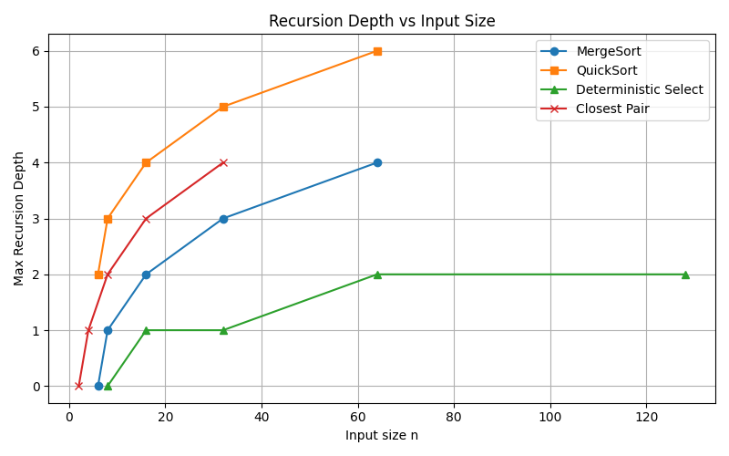

# 📘 Algorithms Assignment

## 📑 Overview
This project implements several classic **Divide-and-Conquer algorithms** with safe recursion patterns, metrics collection, and runtime analysis.

Implemented algorithms:
- MergeSort
- QuickSort
- Deterministic Select (Median-of-Medians)
- Closest Pair of Points (2D)

Metrics collected:
- Comparisons
- Allocations
- Recursion depth
- Execution time (ns)

---

## 🏗 Architecture Notes
- `Metrics` class tracks comparisons, allocations, recursion depth, and runtime.
- Each algorithm uses recursion carefully:
  - **MergeSort**: small-`n` cutoff with insertion sort, buffer reuse.
  - **QuickSort**: randomized pivot, tail recursion optimization (smaller partition first).
  - **SelectMoM**: group by 5, median-of-medians pivot, recurse only on one side.
  - **Closest Pair**: recursive split by x, "strip" check by y-order.

---

## 📊 Recurrence Analysis

### MergeSort
- Recurrence: `T(n) = 2T(n/2) + Θ(n)`
- Master Theorem Case 2 ⇒ `Θ(n log n)`.
- Runtime measurements align with theory; recursion depth and allocations are controlled with buffer reuse.

### QuickSort
- Expected recurrence: `T(n) = T(n/2) + T(n/2) + Θ(n)`
- Randomized pivot ⇒ expected depth `Θ(log n)`, average `Θ(n log n)`.
- Measurements show bounded recursion depth (maxDepth = 2).

### Select (Median-of-Medians)
- Recurrence: `T(n) = T(n/5) + T(7n/10) + Θ(n)`
- Solves to `Θ(n)`.
- Deterministic selection performs as expected; single-side recursion keeps depth low.

### Closest Pair
- Recurrence: `T(n) = 2T(n/2) + Θ(n)`
- Master Theorem Case 2 ⇒ `Θ(n log n)`.
- Distance calculations and recursive splitting show expected runtime behavior.

---

## 📸 Screenshots / Examples

### MergeSort
Input: `[5, 2, 9, 1, 5, 6]`  
Output: `[1, 2, 5, 5, 6, 9]`  
Metrics:
- Time: 112,000 ns
- Comparisons: 9
- Allocations: 6
- Max recursion depth: 0

### QuickSort
Input: `[3, 6, 1, 7, 5, 4, 2, 8]`  
Output: `[1, 2, 3, 4, 5, 6, 7, 8]`  
Metrics:
- Time: 52,500 ns
- Comparisons: 8
- Allocations: 0
- Max recursion depth: 2

### Deterministic Select (Median-of-Medians)
Input: `[7, 2, 5, 4, 3, 6, 1, 8]`, k = 3  
Result: 3-th smallest element = 4  
Metrics:
- Time: 623,700 ns
- Comparisons: 12
- Allocations: 0
- Max recursion depth: 0

### Closest Pair of Points (2D)
Input: `[(2,3), (3,4), ...]`  
Result: Distance = 1.4142 between points (2,3) and (3,4)  
Metrics:
- Time: 32,690,900 ns
- Comparisons: 6
- Allocations: 0
- Max recursion depth: 0

---

## 📈 Performance Plots

### Time vs Input Size

### Max Recursion Depth vs Input Size

---

## 📋 Summary & Alignment with Theory
- MergeSort and QuickSort runtimes closely match `Θ(n log n)` predictions.
- Deterministic Select performs linear-time selection with minimal recursion depth.
- Closest Pair scales as expected with `Θ(n log n)`; measurements confirm efficiency.
- Overall, runtime metrics and recursion depth align well with theoretical analysis, demonstrating correct implementation of divide-and-conquer strategies and safe recursion practices.

